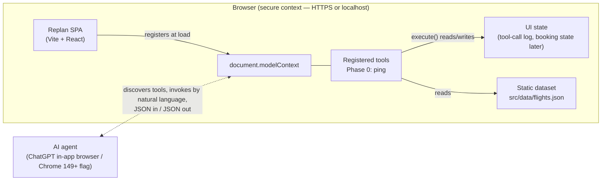

# Architecture Overview

Status: Phase 0 snapshot (2026-08-31). Updated per phase.

## System shape

One static SPA. No server runtime, no custom model. The "agent" is ChatGPT
itself (or a WebMCP-enabled Chrome) on the client side.

## Boundaries

- **Tools are the product surface.** Everything an agent can do, it does
  through a registered WebMCP tool. Phase 0 registers exactly one smoke tool
  (`ping`) to prove discovery end-to-end; business tools (flight search, hold,
  confirm, hotels, transport, notifications) arrive in later phases with task
  contracts first.
- **The UI is a live view of tool activity** — it renders state that tools
  mutate, so a human watching the page sees the agent work. No
  human-only paths mutate booking state.
- **Data is static and versioned in-repo** (`src/data/flights.json`);
  simulated writes (holds, bookings) live in client memory only.

## WebMCP integration

See `webmcp-integration.md` in this directory for the registration pattern,
API constraints (secure context, no iframe tools, abort-based
unregistration), and the error-as-value convention.

## Verification architecture

`scripts/verify.sh` is the single deterministic gate: typecheck (`tsc -b`) →
lint (oxlint) → build (`vite build`) → unit (vitest) → optional deploy smoke
(`--url`). Exit 0 gates every commit. What it cannot check — that a real
WebMCP-capable agent actually discovers `ping` — stays a manual, evidenced
step recorded in `agent-memory/`.

## Deployment

Static `dist/` on Vercel (challenge rules allow any host; Vercel is a
supporter and its CLI is available locally). Current URL recorded in
`agent-memory/current.md`.
